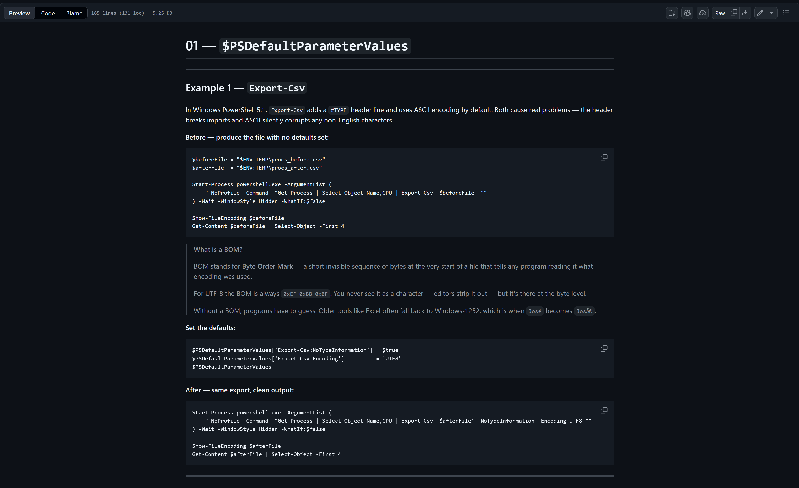

# PowerShell Profiles Presentation

This repository contains the slides, demos, and reusable profile snippets for my **PowerShell Profiles** presentation.

---

## Folder Structure

- **demos/**  
  Live demo profiles organized by topic and presentation order.  
  These are safe, pre-written examples used during the talk.
  Also includes a readme which should be viewed while running the demo.

  [](./images/readme_preview_example.png)

- **images/**  
  Store for images used in the project.

- **modules/**  
  Module for various live demo functions and making them work to get a point accross.

- **slides/**  
  Slide deck and speaker notes.

---

## Presentation Goals

- Explain what PowerShell profiles are and how they load
- Demonstrate profile scopes and paths
- Show how to build a profile
- Improve shell productivity safely

---

## Running the Demos

Open PowerShell 7+ and navigate to the `demos` directory:

```powershell
cd .\demos
```

Inside the demos directory run the below command to begin the demo:

```powershell
.\Run-Demo.ps1
```

If needed, start PowerShell without loading a profile:

```powershell
pwsh -NoProfile
```

---

## Recommended Setup

- PowerShell 7+
- VS Code (optional)
- Oh My Posh (optional for prompt demonstrations)
- ReadMe Preview Utility to view while running the demo (I have used this one in VSCode: https://marketplace.visualstudio.com/items?itemName=shd101wyy.markdown-preview-enhanced)

---
